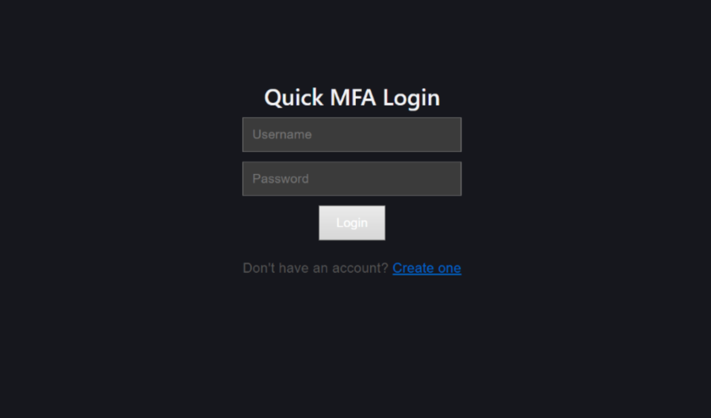
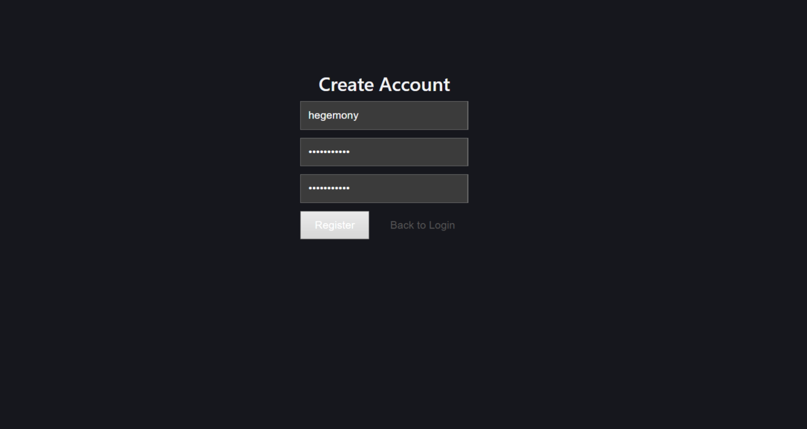
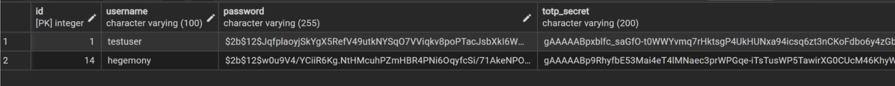
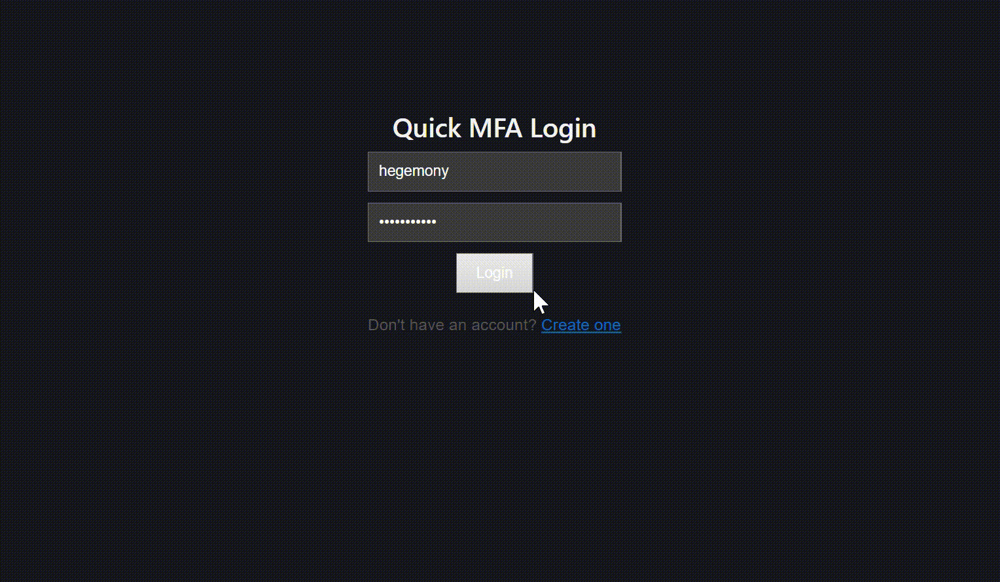
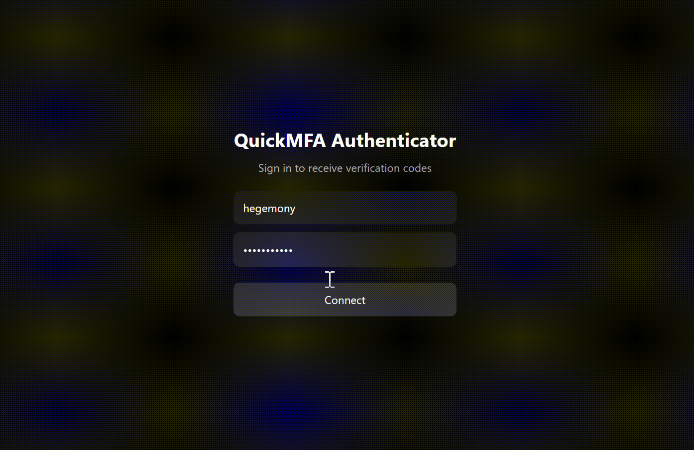
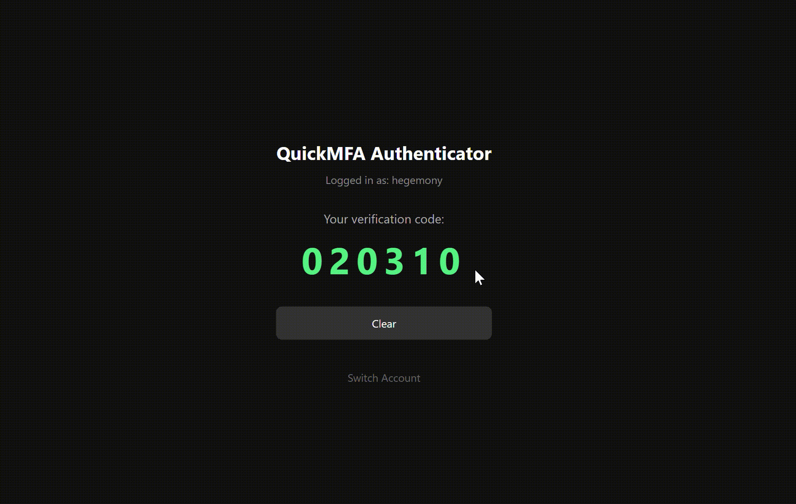

# Quick-SecureMFA
A personal project built to develop hands-on security hardening skills while building a fast, functional multi-factor authentication system from scratch.
It's a full-stack MFA system built with React, Flask, PostgreSQL, and Redis — including a separate web-based authenticator app that simulates a mobile authenticator for local testing.

## This project has 3 endpoints: Frontend, Backend, and Mobile Authenticator.
**Frontend** - localhost:5173 -> Web interaction layer  
**Backend** - localhost:5000 -> Handles connection logic and SQL database  
**Authenticator App** - localhost:8080 -> Simulates mobile authentication for testing

## Login Flow
1. The user opens the frontend and enters their username and password to begin the login process.

The user can create an account where the password and username are saved within a PostgreSQL connected database. 

2. The backend then checks the entered password against a bcrypt-hashed version stored in PostgreSQL to verify it's correct.

3. The user can now log in with the credentials, and once the password is verified, Redis stores a temporary session token that expires in 120 seconds to keep the window short.

4. The user then clicks "Send Code to App" to trigger the generation of a one-time code. 

5. The user logs into the mobile authenticator app, which polls the backend every 2 seconds 
to receive and display the 6-digit code. 

6. Finally, entering the code into the frontend allows the user access into their account. The user is now fully authenticated and granted access.

## Tools Used
| Layer         | Technology                                    |
|---------------|-----------------------------------------------|
| Frontend      | React (Vite)                                  |
| Backend       | Python (Flask)                                |
| Authenticator | AppExpo (React Native Web)                    |
| Database      | PostgreSQL (pgAdmin4) / SessionsRedis (Docker)|

## Installation
Terminal 1 - Backend:  
python app.py

Terminal 2 - Frontend:  
npm run dev

Terminal 3 - Authenticator App:  
npx expo start

I have more goals to learn: 
- Ensure the code generated cannot be accessed through inspect element looking at the plaintext (done)
- Ensure connection is HTTPS to securely hide info (done)
- Prevent brute force attacks by lowering login attempts for a specific user

## Security Progress

**Completed:**
- Passwords protected — bcrypt hashing
- TOTP secrets encrypted at rest — Fernet encryption in PostgreSQL
- Session expiry — Redis TTL (120s temp, 1hr session)

**Planned:**
- Rate limiting - Flask-Limiter
- Account lockout - Redis failed attempt counter
- Logout / session revocation — Redis key deletion route
- Input validation - Server-side sanitization
- HTTPS — SSL cert + domain (production only)
- CSRF protection - Flask-WTF tokens

## API Routes
| Method | Route | Description |
|--------|--------|------------|
| POST | `/register` | Register a new user |
| POST | `/login` | Verify password, returns temporary token |
| POST | `/generate-code` | Generate and store a TOTP code |
| POST | `/verify-totp` | Verify entered code, returns session token |
| GET | `/get-code/<username>` | Authenticator app polls for display code |
| POST | `/authenticator-login` | Login for the authenticator app |
| POST | `/save-token` | Save Expo push token for a user |
